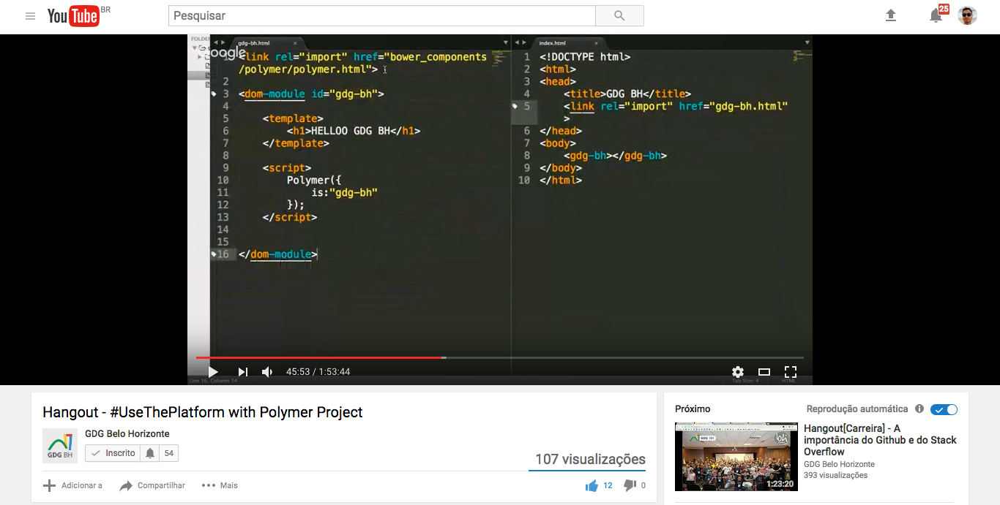

# GDG BH Polymer Element

> Exemplo de Webcomponent (utilizando Polymer 1x) realizado durante o [Hangout do GDG-BH](https://www.youtube.com/watch?v=AfOis1W-pkU&feature=youtu.be&utm_content=buffer9b8c6&utm_medium=social&utm_source=facebook.com&utm_campaign=buffer) de Jan/201].

## Hangout Sobre Polymer e Webcomponents

Host: [Yan Magalhães](https://github.com/yanmagale)  
Palestrante: [Afonso Pacifer](https://github.com/afonsopacifer)

- [Google Developers Group - Belo Horizonte](https://www.meetup.com/pt-BR/GDG-BH/)
- [Hangout completo no youtube](https://www.youtube.com/watch?v=AfOis1W-pkU&feature=youtu.be&utm_content=buffer9b8c6&utm_medium=social&utm_source=facebook.com&utm_campaign=buffer)
